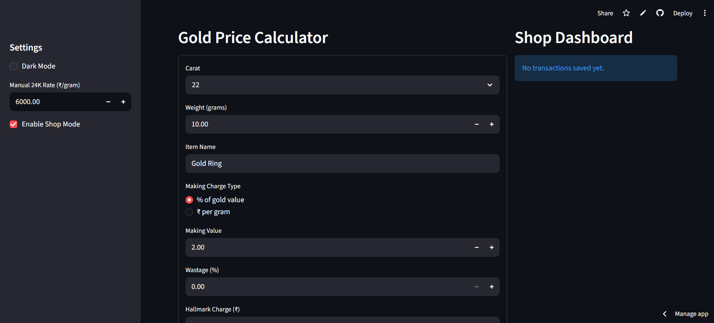
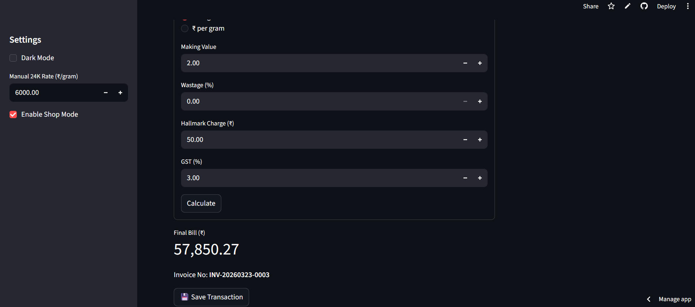
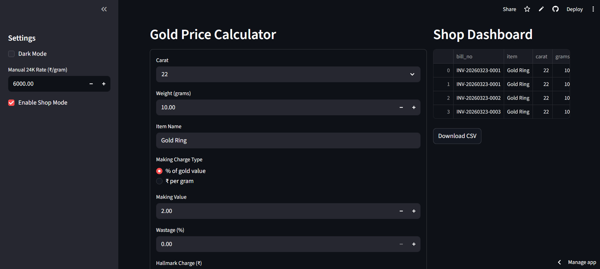
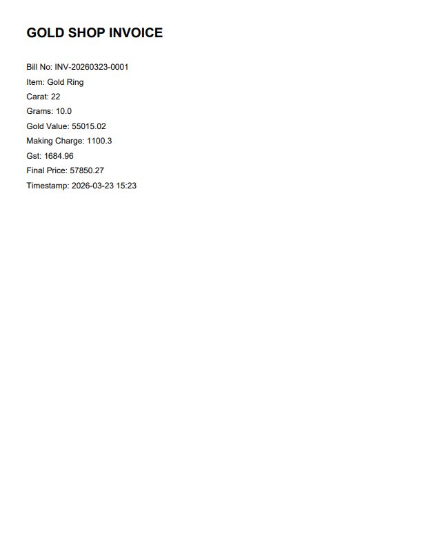

# 🪙 Gold Price Calculator (Streamlit App)

## 📌 Problem
Calculating the final gold price in jewellery shops is often complex due to:
- 💰 Different gold purity levels (24k, 22k, etc.)
- 🧾 Additional charges like wastage, making charges, hallmark fees  
- 📊 GST calculations  
- ❌ Lack of transparency in final pricing  

👉 This creates confusion for both customers and shop owners.

---

## 💡 Solution
Developed a **user-friendly Streamlit web application** to accurately calculate gold prices with a complete cost breakdown.

Key functionalities:
- 🪙 Carat-based pricing (24k, 22k, 20k, 18k)  
- ⚖️ Wastage calculation  
- 💸 Making charges (percentage or per gram)  
- 🏷️ Hallmark charges  
- 🧾 GST calculation  
- 📊 Full price breakdown for transparency  
- 📈 Simulated historical price visualization  
- 🏪 Shop mode with transaction saving & CSV export  

---

## 🌐 Live Demo
👉 https://goldpricecalculator-vishaljadhav.streamlit.app/

---

## 🛠️ Tech Used
- 🐍 Python  
- 🌐 Streamlit  
- 📊 Pandas  
- 📈 Altair (for charts)  
- 📁 CSV handling  

---

## 📊 Features

- 🎨 Clean & modern UI (with dark mode support)  
- 🏪 Shop mode for real business usage  
- 📂 Transaction history with CSV download  
- 📈 Interactive charts for price trends  
- ⚡ Fast and responsive performance  

---

## 📷 Screenshots

### 🧮 Gold Price Calculator Interface



- Supports carat-based pricing (24K, 22K, etc.)
- Handles making charges, wastage, and GST
- Dynamic price calculation based on inputs

---

### 🏪 Shop Dashboard & Transaction Management


- Generates unique bill numbers
- Stores transaction records
- Export transactions as CSV

---

### 💰 Price Breakdown Output


- Detailed cost breakdown
- Transparent pricing logic
- Real-time calculation updates

---

## 🚀 Future Improvements

- 🌍 Integrate real-time gold price APIs  
- 🔐 Add user authentication for shop owners  
- ☁️ Store transaction history in a database  
- 📱 Make it mobile-friendly / PWA  
- 💳 Add billing and invoice generation system  

---

## 🛠️ Installation & Setup

### 1️⃣ Clone the repository
```bash
git clone https://github.com/VishalJadhav-codes/Gold_Price_Calculator.git
```

### 2️⃣ Install dependencies
pip install -r requirements.txt

### 3️⃣ Run the app
https://goldpricecalculator-vishaljadhav.streamlit.app/

## 📬 Connect With Me
- 📧 Email: vishaljadhav12119036@gmail.com  
- 💼 LinkedIn: www.linkedin.com/in/vishaljadhav01
